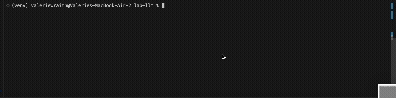

# ValChat

ValChat is an AI chat agent that can read and analyze files in your current directory using Groq's LLM API.

[](https://github.com/vwraith55/llm-lab/actions/workflows/doctests.yml)
[](https://github.com/vwraith55/llm-lab/actions/workflows/integration-tests.yml)
[](https://github.com/vwraith55/chat-llm/actions/workflows/flake8.yml)
[](https://codecov.io/gh/vwraith55/chat-llm)
[](https://pypi.org/project/cmc-csci040-valerie/)



```bash
% cd markdown
% chat
chat> what does this project do?                
It appears that this project is a simple markdown to HTML compiler. It can convert markdown files to HTML and also include fancy CSS formatting with the `--add_css` flag.
chat> what file formats does this project support?
This project currently supports Markdown (.md) file format for conversion to HTML.
```

```bash
% cd ebay-webscraper
% chat
chat> ls
It appears you have several files in the current directory, including README.md, a Python script (ebay-dl.py), and various JSON and CSV files related to headphones, laptops, and water bottles.
chat> what packages does ebay-dl.py use?
The script uses the following packages:

- argparse
- csv
- json
- re
- time
- random
- bs4 (BeautifulSoup)
- playwright
```

```bash
% cd vwraith55.github.io
% chat
chat> what is this project about?
It appears that this project is related to a GitHub repository named "cslab4" owned by "vwraith55".
chat> ls
The current directory contains the following files and directories:
1. Quiz 1
2. README.md
3. favfoods.html
4. favplaces.html
5. giphy.gif
6. image.webp
7. index.html
8. style.css
9. title.animation.gif
chat> what does favfoods.html tell you?
The favfoods.html file appears to be a webpage that lists the author's favorite foods, along with a brief description and a link to a restaurant rating app called Beli. The page also includes a disclaimer stating that it is not an advertisement.
```
