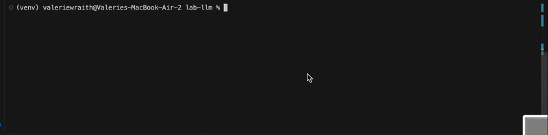

# ValChat

ValChat is an AI chat agent that can read and analyze files in your current directory using Groq's LLM API.

[](https://github.com/vwraith55/chat-llm/actions/workflows/doctests.yml)
[](https://github.com/vwraith55/chat-llm/actions/workflows/integration-tests.yml)
[](https://github.com/vwraith55/chat-llm/actions/workflows/flake8.yml)
[](https://codecov.io/gh/vwraith55/chat-llm)
[](https://pypi.org/project/cmc-csci040-valerie/)

## Demo 


## Example: Markdown
This example demonstrates how ValChat can read a project's README and source files to provide a clear summary of its functionality and supported formats without any manual file navigation.

```bash
% cd markdown
% chat
chat> what does this project do?                
It appears that this project is a simple markdown to HTML compiler. It can convert markdown files to HTML and also include fancy CSS formatting with the `--add_css` flag.
chat> what file formats does this project support?
This project currently supports Markdown (.md) file format for conversion to HTML.
```


## Example: Ebay-Webscraper
This example shows ValChat automatically using the ls and cat tools to explore the project structure and analyze source code dependencies without the user needing to specify which files to read.

```bash
% cd ebay-webscraper
% chat
chat> ls
It appears you have several files in the current directory, including README.md, a Python script (ebay-dl.py), and various JSON and CSV files related to headphones, laptops, and water bottles.
chat> what packages does ebay-dl.py use?
The script uses the following packages:

- argparse
- csv
- json
- re
- time
- random
- bs4 (BeautifulSoup)
- playwright
```


## Example: Webpage
This example demonstrates ValChat navigating a personal website project by listing its files and reading HTML content to summarize the page's purpose and structure.

```bash
% cd vwraith55.github.io
% chat
chat> what is this project about?
It appears that this project is related to a GitHub repository named "cslab4" owned by "vwraith55".
chat> ls
The current directory contains the following files and directories:
1. Quiz 1
2. README.md
3. favfoods.html
4. favplaces.html
5. giphy.gif
6. image.webp
7. index.html
8. style.css
9. title.animation.gif
chat> what does favfoods.html tell you?
The favfoods.html file appears to be a webpage that lists the author's favorite foods, along with a brief description and a link to a restaurant rating app called Beli. The page also includes a disclaimer stating that it is not an advertisement.
```
## Agent in Action

The session below demonstrates that `ValChat` can create files when asked
and these files are automatically added to the git repo.

```
$ git log --oneline
e36e204 (HEAD -> project4) add Ralph Wiggum loop
$ python3 chat.py
chat> Create a file called greet.py that prints 'hello from the agent'
The file `greet.py` has been created with the specified content.
chat> ^C
$ cat greet.py
print('hello from the agent')
$ git log --oneline -3
dc09793 (HEAD -> project4) [docchat] Added greet.py file that prints a hello message
e36e204 add Ralph Wiggum loop
```

The session below demonstrates that `ValChat` can delete files and automatically commit the changes.

```
$ python3 chat.py
chat> Delete the file greet.py
The file greet.py has been deleted from the current directory.
chat> ^C
$ ls
README.md  chat.py  demo.gif  hello.py  pyproject.toml  requirements.txt  setup.cfg  test_projects  tools
$ git log --oneline -3
6a31ae5 (HEAD -> project4) [docchat] rm greet.py
dc09793 [docchat] Added greet.py file that prints a hello message
e36e204 add Ralph Wiggum loop
```

## Extra Credits

### pip_install tool (1pt)
The agent can install Python libraries on demand.

```
$ python3 chat.py
chat> Call pip_install with library_name="cowsay"
The 'cowsay' library has been successfully installed.
chat> ^C
```

### Ralph Wiggum Loop (2pts)
Whenever doctests fail after writing a Python file, the agent automatically retries until they pass.

```
$ python3 chat.py
chat> Use write_file to create test_wiggum.py with content: def add(a, b):\n    """\n    >>> add(2, 2)\n    99\n    """\n    return a + b
chat> ^C
$ cat test_wiggum.py
def add(a, b):
    """
    >>> add(2, 2)
    4
    """
    return a + b
$ git log --oneline -3
369ce75 [docchat] Fixed test_wiggum.py
90e034a [docchat] Initial commit of test_wiggum.py
818f04f [docchat] Initial commit of test_wiggum.py
```

### File Diff/Patch (4pts)
The agent can update files using diffs instead of overwriting them, powered by `wiggle`.